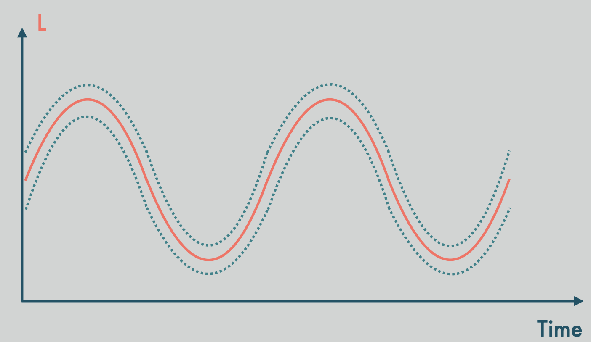
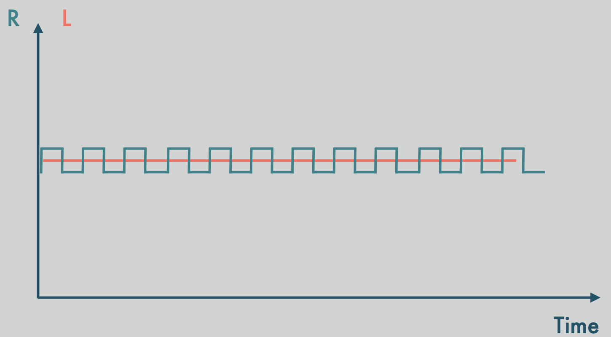
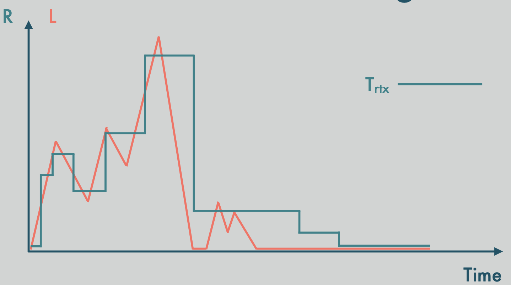

# Domain Specific Language (DSL)
DSL involves two parts:
1. **Declarative part**: resource type - (resource: hardware or software components)
2. **Implementation part**: resource driver

## Resource types:
- Describes a set of ports that specify attributes: (**ports of each component**)
	+ internal configuration of a component
	+ internal configuration of a depended component
	+ exported by the component
- Defines dependencies on other resources: (**BIP Coordination: structural constraints**)
	+ environment dependencies: (Virtual Machine -> Apps)
	+ peer dependencies: (betweens apps)
	+ inside dependencies: (data of an app)
- allows to generate deployment plans: (**BIP Coordination: functional constraints**)
- allows to verify deployment properties: (**Cloud properties**)
	+ elasticity
	+ resource management
      - *Precision*: Precision constrains the amount of resources that system is allowed to over- or under-provision.
      
      - *Oscillation*: system must not allocate or deallocate resources when the load is stable
      
      - *Resource Thrashing*: Elastic system must not deallocate resources shortly after allocating them and vice versa
      
      - *Cool-down period*: Elastic controller must not change resources during the period of VM initialization.
      - *Bounded resource usage*: Elastic controller must not perform more than N changes during the period of VM initialization

## Resource driver: (Components' FSM)
It presents the state machine that installs and manages the life-cycle of the resources. Each state machine has, at least, three states that are uninstalled, active, and inactive.
### Linear time property
Two types of Linear time property:
- Safety properties: ensure that "bad things" do not happen
- Liveness properties: ensure that "good things" do happen

System must follow properties to *avoid incorrect behaviors*

To do this, the controller observes all the system events and enforces it to respect the properties, which are regarded as constraints imposed by the system.

Model checking is used to verify that the properties are respected during the protocol execution. (Some properties in p.111)
### Accord coordinator - p. 68
### 40 properties - cite 102
