# PSL - property specification language

Assertions are at the heart of PSL. An assert construct provides the user with a way to check at run time or at simulation time that a certain condition holds, and to report a warning or an error if it does not.

The structure of PSL is based on four layers:
1. ***Boolean layer***: composed of Boolean expressions.
2. ***Temporal layer***: consists of temporal properties which describe the relationships between Boolean expressions over time. For example, ***always (req -> next ack)*** is a temporal property expressing the fact that whenever (**always**) signal req is asserted, then (**->**) at the next cycle (**next**), signal ack is asserted.
3. ***Verification layer***: consists of directives which describe how the temporal properties should be used by verification tools. For example, **assert** always (req -> next ack);
4. ***Modeling layer***: provides a means to model behavior of design inputs, and to declare and give behavior to auxiliary signals and variables.

**LTL operators**
### 1. Weak operators
1.1. **always** and **never**

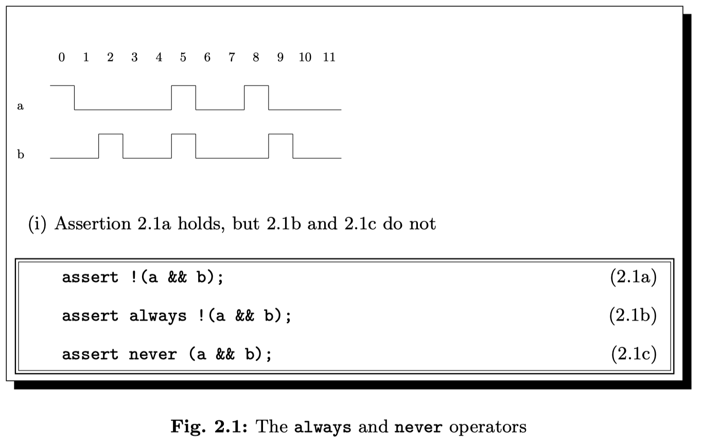

1.2. **next** operators
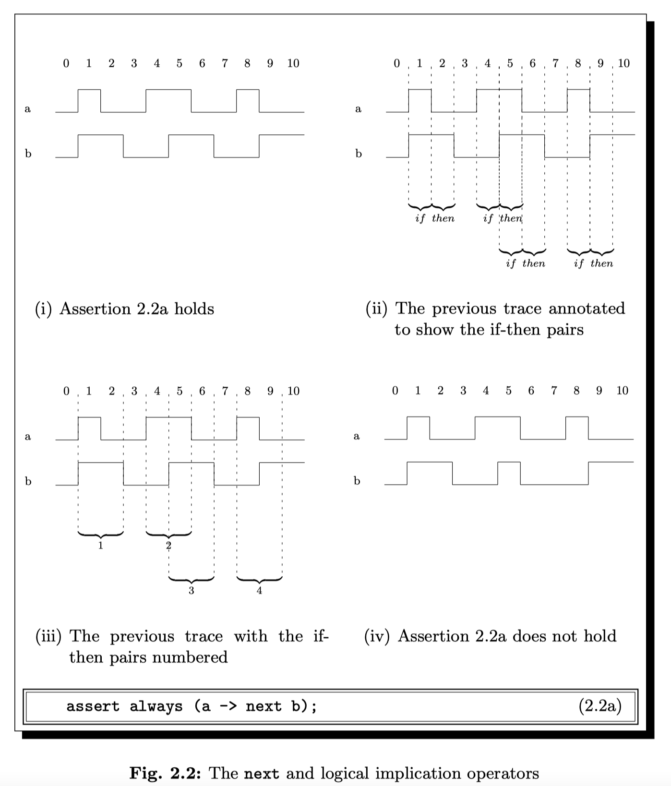
It indicates that the property will hold if its operand holds at the next cycle.
.
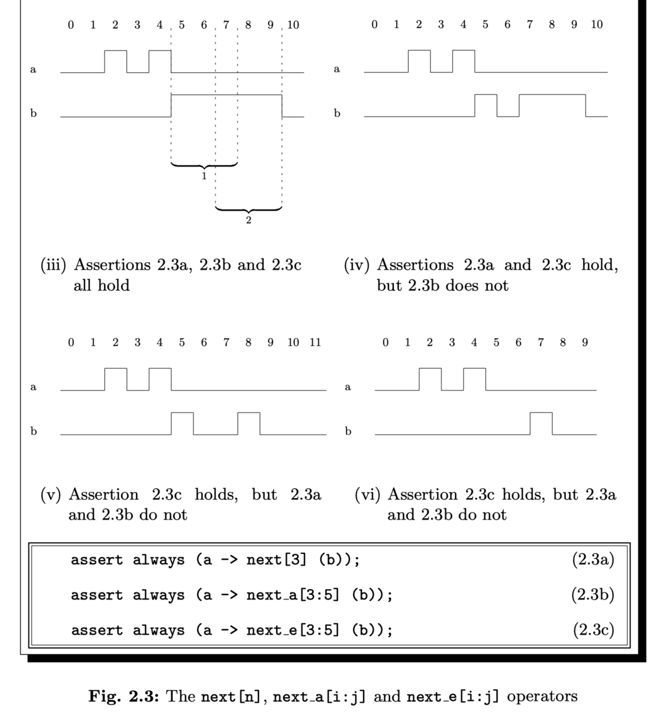
A **next_a[i:j]** property holds if its operand holds in *all* of the cycles from the *i* next cycle through the *j* next cycle, inclusive.

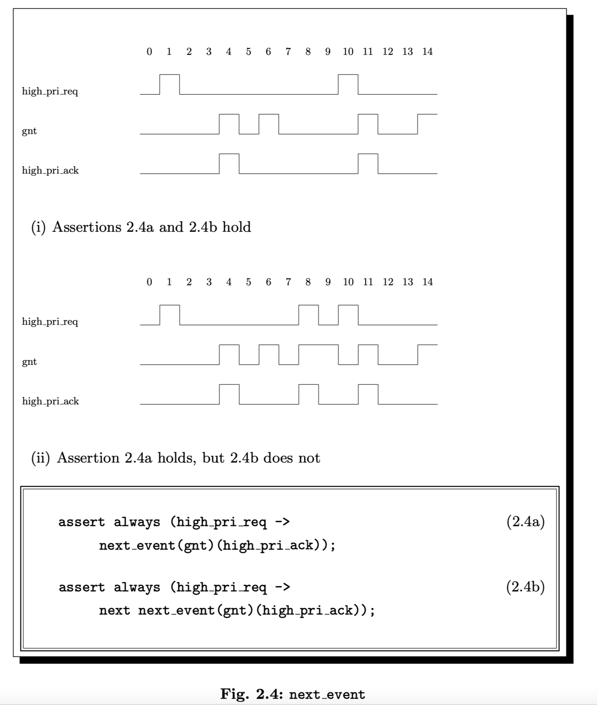
**next_event** refers to the **nearest** cycle in which some Boolean condition holds.
*Note: The next event operator includes the current cycle.*

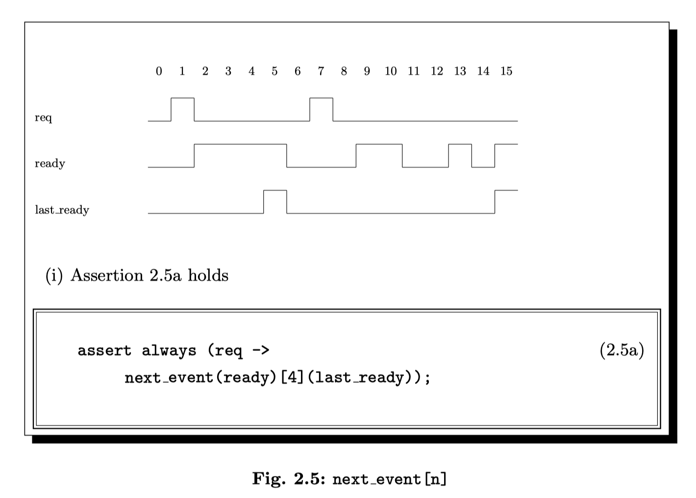
The form ***next_event_a(b)\[i:j ](f)*** indicates that we expect *f* to hold on all of the *i* through *j* occurrences of *b*.

1.3. **until** operators
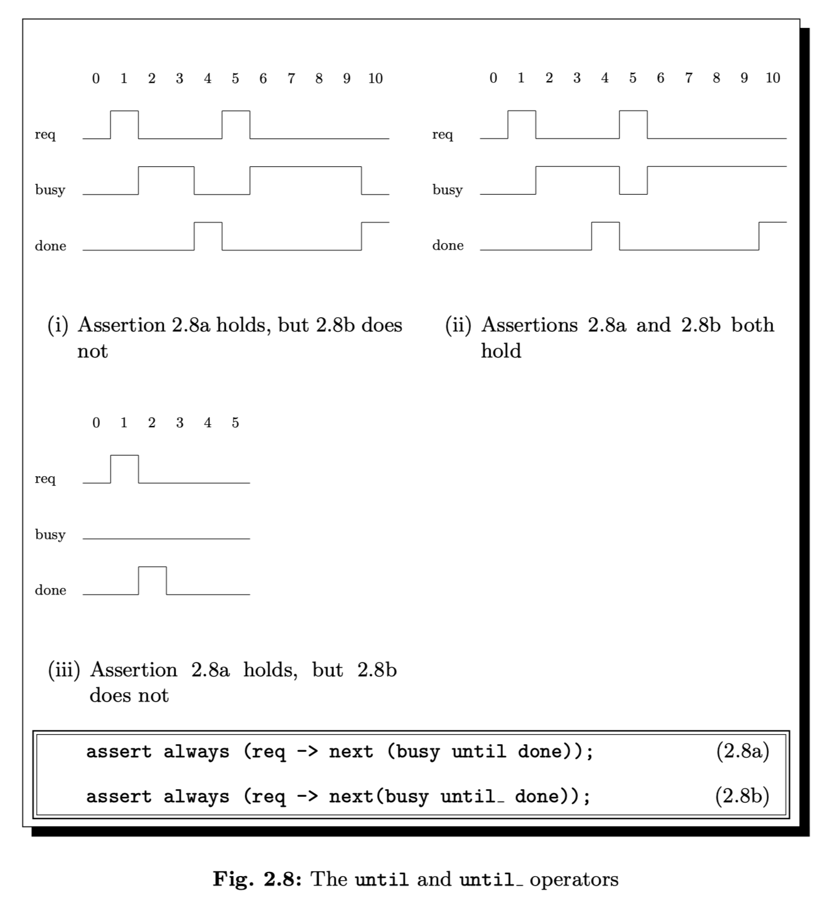
underscore(_) the overlaps between left and right

1.4 **before** operators
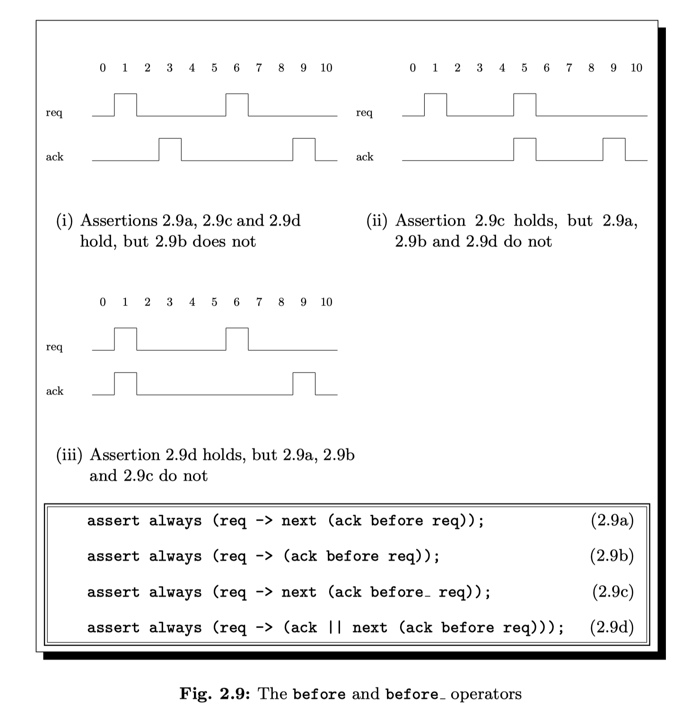
The before family of operators provides an easy way to state that we require some signal to be asserted before some other signal.  
The underscore (_) is intended to represent the cycle in which we allow an overlap between the left and right sides.

### 2. Strong operators
2.1. strong **next_event**
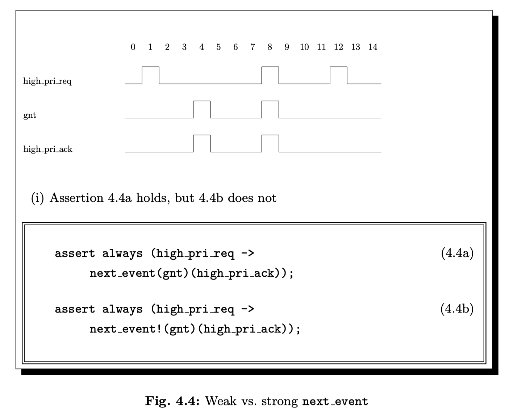

2.2. strong **until**
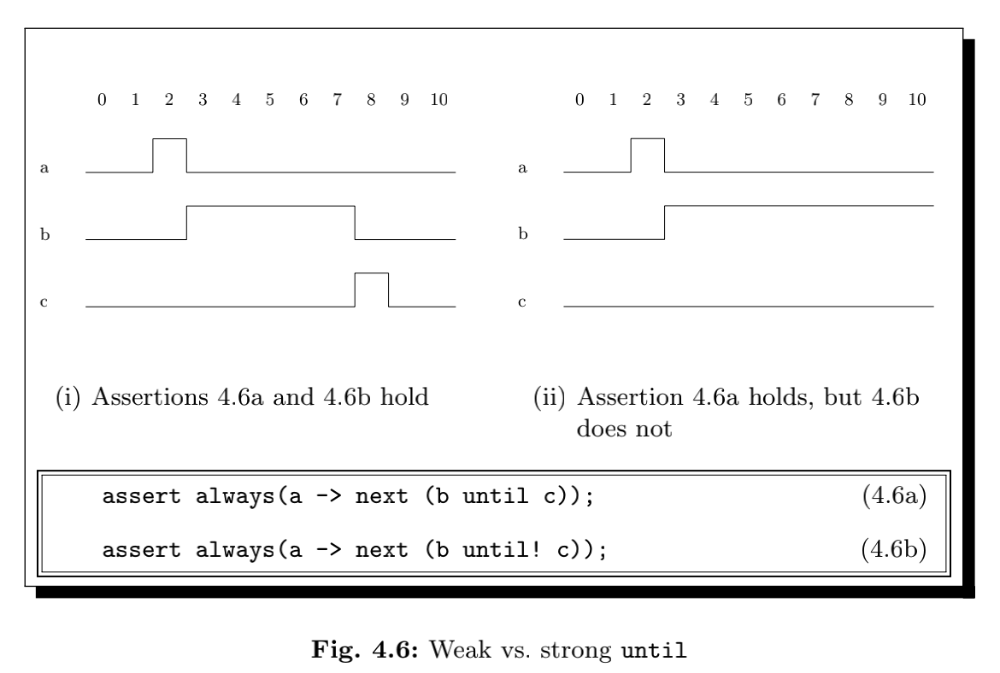
The *until!* operator is the strong version of the until operator. The *until!* operator holds only if its left operand stays asserted up to and including the cycle where its right operand is asserted, and in addition its right operand eventually holds.

2.3. strong **before!** and **before!** operators
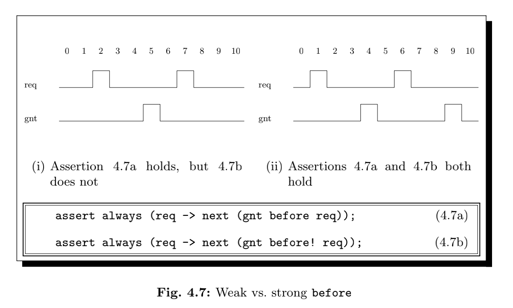

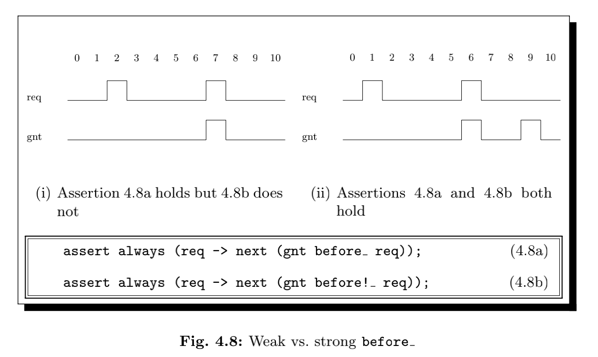

Strong operators requiring that:
- nothing bad must happen up until some terminating condition, and  
- the terminating condition must eventually occur.

The weak versions then waive the requirement that the terminating condition eventually occur, leaving only the requirement that nothing bad must happen.

The *eventually!* operator, however, contains no idea of a bad “something”, only a terminating condition.
